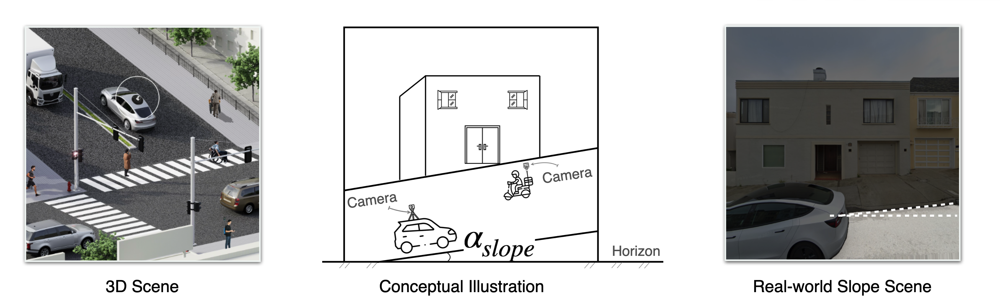

[](LICENSE)
[](https://www.python.org/downloads/)
[](https://ual.sg/publication/2026-ijgis-vision-2-slope/2026-ijgis-vision-2-slope.pdf)
[](https://www.doi.org/10.1080/13658816.2026.2656269)

<div align="center">
    <a href="" title="Vision2Slope — Street-view-based urban slope estimation framework">
        
    </a>
</div>

# Vision2Slope

An integrated pipeline for two-level road slope analysis from single panoramic street view images

## Overview

**Vision2Slope** is a comprehensive pipeline designed to analyze road slopes using single panoramic street view images. The pipeline leverages advanced computer vision techniques to extract and compute slope information along the road, including both **point-level and segment-level** analyses, which can be useful for various applications such as urban planning, navigation, and infrastructure development.

## Core Idea
<div align="center">
    <a href="" title="Vision2Slope — Core idea">
        
    </a>
</div>
Vision2Slope builds on a simple but powerful observation illustrated in this figure: road slope is implicitly encoded in street-level perspective. In the left 3D scene, the slope exists as a physical property of the road surface, but it is not directly measurable without elevation data. The middle conceptual diagram highlights the key insight—when a camera captures a sloped street, the relationship between the road surface, vertical structures (e.g., buildings), and the horizon is geometrically constrained, and the slope angle (α) manifests as a systematic tilt in the scene. The right real-world example shows how this tilt appears in actual street view imagery, where road edges and building lines deviate from expected horizontal–vertical alignments. Vision2Slope leverages this principle by first correcting camera orientation using vertical references, and then extracting slope from the geometry of road surfaces in the image.


## Key Features

- **Panorama Support**: Automatically converts panoramic street view images to perspective views (left and right) for accurate slope analysis.

- **Side-view Deskewing**: Transforms panoramic images into side-view perspectives and corrects vertical distortions to ensure accurate analysis using semantic and geometric prompts.

- **Point-level Slope Estimation**: Computes the slope of the road surface at specific points using the segmented road areas and their 3D geometry.

- **Segment-level Slope Estimation**: Analyzes the slope over larger road segments to provide a comprehensive understanding of road gradients and relief.


## Usage and Installation

### Example Code Snippet and Tutorial
Please refer to the [Tutorial](examples/Vision2Slope_Tutorial.ipynb) or [Script](examples/example.py) for detailed instructions on how to use Vision2Slope for slope estimation from street view images.

------
### Quick prompts based on the tutorial
1. Install from source:
```bash
python -m pip install -e ./src/Vision2Slope
```
2. Import the pipeline in Python:
```python
from vision2slope import (
    PipelineConfig,
    VisualizationConfig,
    ProcessingConfig,
    Vision2SlopePipeline
)
```
3. Optional: download Mapillary panoramas (requires an API key):
```python
# Example: Download Mapillary panoramas for San Francisco area
from zensvi.download import MLYDownloader

mly_api_key = "YOUR_MAPILLARY_API_KEY_HERE"
downloader = MLYDownloader(mly_api_key=mly_api_key)
downloader.download_svi(
    "sf",
    lat=37.797423890238,
    lon=-122.44403351517,
    buffer=5,
    resolution=2048,
    image_type="pano"
)
```
4. Configure and run panoramic processing:
```python
config_panorama = PipelineConfig(
    input_dir="sf/mly_svi/batch_1",
    output_dir="sf/mly_svi/output_pano",
    processing_config=ProcessingConfig(
        is_panorama=True,
        panorama_fov=90,
        panorama_phi=0.0,
        panorama_aspects=(10, 10),
        panorama_show_size=100,
        log_level="INFO"
    ),
    viz_config=VisualizationConfig(
        save_visualizations=True,
        save_corrected_images=True,
        save_intermediate_results=True
    )
)

pipeline_panorama = Vision2SlopePipeline(config_panorama)
results_panorama = pipeline_panorama.process_batch()
```


## Results

The pipeline generates detailed slope analysis results, including visualizations of slope distributions and numerical slope values for both point-level and segment-level analyses.


*Figure: Two-level road slope maps using Vision2Slope.*

## TODO list

✅ Release the codebase

✅ Add installation instructions

✅ Provide usage examples

✅ Support panoramic image input

✅ Integrate more SVI platforms into Vision2Slope (thanks to [ZenSVI](https://github.com/koito19960406/ZenSVI) library)

✅ Expand study to diverse geographic locations (have preliminary results in Singapore, Hong Kong, La Paz, and some cities in China, if you are interested in collaborating, please reach out to us!)

## Citation

If you find this project useful for your research or applications, please consider citing it as follows:

```bibtex
@article{chen2026vision2slope,
  title={Vision2Slope: estimating urban road slopes with street view imagery},
  author={Chen, Yang and Fan, Zicheng and Li, Hao and Zhao, Wufan and Yang, Xin and Tang, Guoan and Biljecki, Filip},
  journal={International Journal of Geographical Information Science},
  pages={1--45},
  year={2026},
  publisher={Taylor & Francis},
  doi={10.1080/13658816.2026.2656269}
}
```

The postprint version of the paper is available on [UAL](https://ual.sg/publication/2026-ijgis-vision-2-slope/2026-ijgis-vision-2-slope.pdf) and the published version can be accessed through the journal's website [IJGIS](https://www.doi.org/10.1080/13658816.2026.2656269).


## Acknowledgements
- Contributors: [Yang Chen](https://cubicsyang.github.io), [Zicheng Fan](https://ual.sg/author/zicheng-fan/), [Hao Li](https://bobleegogogo.github.io/), [Wufan Zhao](http://ai4dcity.com/team), [Xin Yang](http://dky.njnu.edu.cn/info/1213/3995.htm), [Guoan Tang](http://dky.njnu.edu.cn/info/1213/3879.htm) and [Filip Biljecki](https://filipbiljecki.com/).
- This project is inspired and supported by the Google Street View, OpenStreetMap, and Opentopography communities for providing open access to their valuable data resources. Additional thanks to the developers of the open-source libraries utilized in this project, including OpenCV, NumPy, Pandas, Matplotlib, PIL, [ZenSVI](https://github.com/koito19960406/ZenSVI) and [streetlevel](https://github.com/sk-zk/streetlevel).

## License
This project is licensed under the MIT License, see the [LICENSE](LICENSE) file for details.